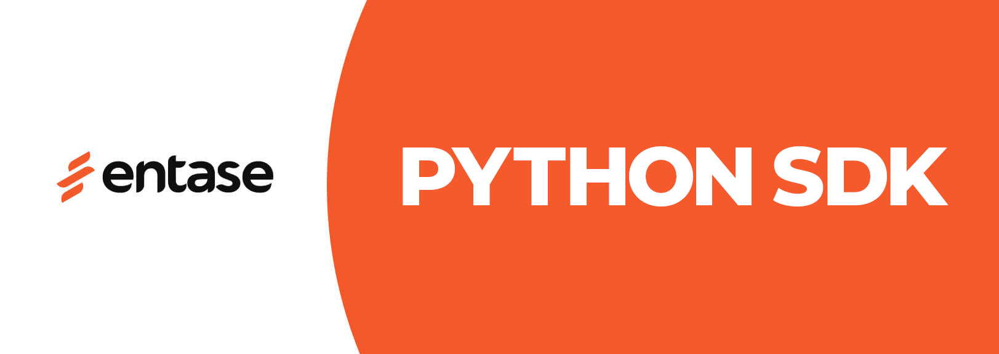

# Python Development Kit for Entase


This library provides easy access to Entase API for Python language.



## Requirements
Python 3.7 or later with the following packages:
- `requests` - For HTTP communication

## Installation

### Via pip
```bash
pip install entase-sdk
```

### Manual Installation
Clone this repository and install using setup.py:
```bash
git clone https://github.com/entaseteam/sdk.python.git
cd sdk.python
pip install .
```

## Getting Started
Initialize the Client with your secret key and you're ready to go:

```python
from entase import Client

# Initialize client
entase = Client('your_secret_key')

# Get upcoming events
upcoming = entase.events.get_all({
    'limit': 10,
    'filter': {
        'status': 1
    }
})

# Process results
for event in upcoming:
    print(event.get('dateStart'))
```

## The ObjectCollection and Pagination
Responses from the API come in two forms - single object or object collection. The object collection interface has an iterable cursor with built-in features for paging the requests.

Example of handling pagination:
```python
# Get all events (limited to 100 per request)
events = entase.events.get_all({'limit': 100})

# Get events in batches of 100 from the API
while events.has_more():
    # Loop through current result set
    for event in events:
        # Process event...
        pass
```

The `has_more()` method will automatically fetch additional batches from the API. Use it with caution to avoid excessive API requests.

You can also access the events collection manually via `events.data`.

### Custom Paging
To handle pagination manually, use the `after` filter to provide the last object ID from your previous result set:

```python
# Get events after a specific ID
events = entase.events.get_all({
    'limit': 100, 
    'after': '6002d051ce1b73294c3aeacc'
})
```

## Error Handling
The client will raise exceptions for API errors. Use try/except blocks for smooth error handling:

```python
from entase.exceptions import BaseError

try:
    productions = entase.productions.get_all({'limit': 10})
except BaseError as e:
    print(f"Error: {e}")
```

## Supported Endpoints

### Productions
- `entase.productions.get_all(data=None)` - Get all productions
- `entase.productions.get_by_id(id_)` - Get production by ID

### Events
- `entase.events.get_all(data=None)` - Get all events
- `entase.events.get_by_id(id_)` - Get event by ID

### Booking Orders
- `entase.booking_orders.get_by_id(id_)` - Get order by ID
- `entase.booking_orders.get_by_code(code)` - Get order by code
- `entase.booking_orders.get_all_tickets_by_order(order_id_or_code)` - Get all tickets for an order
- `entase.booking_orders.get_ticket_by_order(order_id_or_code, ticket_id_or_code)` - Get specific ticket

### Partners
- `entase.partners.get_by_id(id_)` - Get partner by ID
- `entase.partners.me()` - Get current partner info

### Photos
- `entase.photos.get_by_object(objref, data=None)` - Get photos by object reference 
